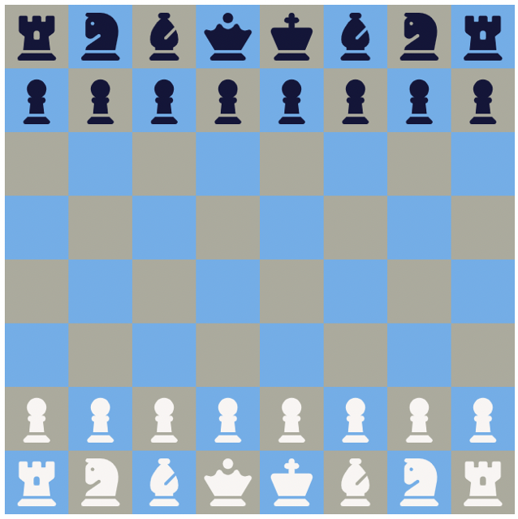
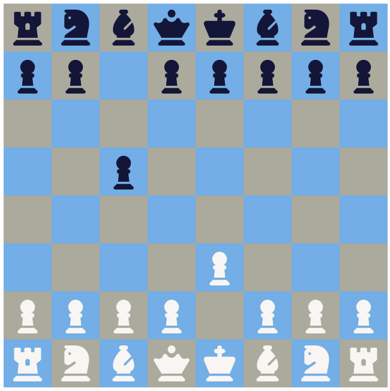

# Javascript Two Player Chess ♟️
## Summary
This is a basic chess game implementation on a web page. It sets up a chessboard and allows players to drag and drop pieces while handling turn-taking and basic piece movement validation.

 

## How it works
### Tech used: Javascript, HTML/CSS

**DOM Elements**
* 'gameboard': The main container for the chessboard
* 'playerDisplay': Shows the current player's turn
* 'infoDisplay': Used for displaying messages, like invalid moves.

**Creating the Board**

* Iterates over startPieces to create 64 squares, adding pieces as inner HTML.
* Assigns a unique square-id to each square for tracking position.
* Alternates square colors to simulate a traditional chessboard.

**Event Listeners**

Adds dragstart, dragover, and drop event listeners to each square for piece movement.
 * dragStart: Stores the initial position and element being dragged.
 * dragOver: Allows the dragged element to be dropped.
 * dragDrop: Handles the piece drop logic, checks for valid moves, and manages turn switching.

